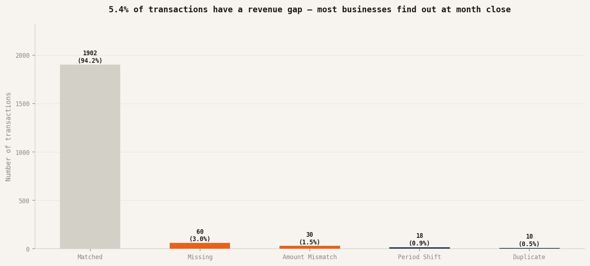

# Revenue Reconciliation Monitor

**Crystal Olisa · Operations Generalist · [Live Dashboard Link](https://crystalolisa.github.io/revenue-reconciliation-monitor/dashboard/)**

---

Revenue reconciliation is talked about as a finance problem. It isn't. It's a visibility problem.

The finance team can't reconcile what the ops layer never flagged. The gap between a transaction succeeding at the payment processor and revenue landing correctly in the business records is an operational monitoring gap - not an accounting error. In a business without a daily monitoring layer, that gap surfaces at month close - 20 to 30 days after it opened.

This project builds the monitoring layer that changes that.

---

## What it builds

A three-phase automated pipeline that:

1. Generates a synthetic two-ledger environment simulating a multi-product SaaS/fintech platform
2. Runs a reconciliation pipeline across both ledgers to classify every gap by type and severity
3. Produces an ops-facing dashboard and findings summary for operational decision-making

The project is a Foundation credential demonstrating financial analysis applied to an operational problem - not accounting work. The monitoring layer is the deliverable. The financial mechanics (revenue recognition, period matching, duplicate detection) are what make the monitoring layer trustworthy.

---

## Pipeline architecture

| Phase | File | Output |
|---|---|---|
| 1 - Data generation | `generate_transactions.py` | `processor_ledger.csv`, `revenue_ledger.csv` |
| 2 - Reconciliation | `pipeline/reconcile.py` | `reconciliation_results.csv` |
| 3 - Analysis | `notebooks/revenue_reconciliation_monitor.ipynb` | Charts + findings summary |

---

## The business problem

A transaction succeeds at the payment processor. The money moves. But somewhere between the processor confirmation and the revenue record, something goes wrong - a booking never happens, an amount is recorded incorrectly, the entry lands in the wrong accounting period, or the same transaction is counted twice.

In most fintech and SaaS businesses, these gaps are invisible until the monthly reconciliation run. By then, the average gap is 25 days old. The revenue figure the business has been reporting is wrong, and the correction is manual, time-consuming, and often incomplete.

The question this project answers: what does a monitoring layer look like that catches these gaps within 24 hours instead of 25 days?

---

## Gap classification

Five gap types detected and classified:

| Type | Description | Revenue impact |
|---|---|---|
| Missing | Transaction in processor ledger, no revenue record | Full transaction amount at risk |
| Amount mismatch | Revenue record exists but amount differs by > 0.5% | Variance amount at risk |
| Period shift | Revenue booked in a different calendar month | No amount risk - timing is the problem |
| Duplicate | Same transaction ID appears more than once in revenue ledger | Duplicate amount overstates revenue |
| Matched | Both ledgers agree | No gap |

---

## Pipeline results



**Gap distribution across 2,000 transactions:**

| Gap type | Count | % of total | Revenue at risk |
|---|---|---|---|
| Matched | 1,902 | 94.2% | — |
| Missing | 60 | 3.0% | Included in total |
| Amount mismatch | 30 | 1.5% | Included in total |
| Period shift | 18 | 0.9% | Timing only |
| Duplicate | 10 | 0.5% | Included in total |
| **Total at risk** | **100** | **5.4%** | **~$38,500** |

**Period shift exposure:**
- Average detection lag: 25 days after transaction
- Maximum detection lag: 43 days after transaction
- A daily monitoring layer would catch period shifts within 24-48 hours of the booking date discrepancy

---

## Synthetic data design

Two paired ledgers simulating a multi-product SaaS/fintech platform operating across 5 product types, 3 processors, and 3 customer segments over a full calendar year (Jan-Dec 2024).

**Product mix:**

| Product | Weight | Amount range |
|---|---|---|
| Subscription monthly | 40% | $29-$299 |
| Subscription annual | 20% | $290-$2,990 |
| Transaction fee | 25% | $1-$150 |
| API usage | 10% | $5-$500 |
| Professional services | 5% | $500-$5,000 |

**Mismatch rates (calibrated against industry benchmarks):**

| Type | Rate | Calibration source |
|---|---|---|
| Missing | 2.5% | Stripe Treasury documentation (2023): ~2-4% gap rate |
| Amount mismatch | 1.5% | Zuora State of the Subscription Economy: fee deduction and FX variance |
| Period shift | 1.5% | Zuora: ~1.5% in high-volume SaaS environments |
| Duplicate | 0.5% | Published fintech post-mortems: ~0.5% double-booking rate |

**Seeds:**
- Transaction generation: `numpy.random.seed(42)`
- Mismatch injection: `numpy.default_rng(seed=77)` - separate RNG preserves transaction profile seed

---

## Repository structure

```
revenue-reconciliation-monitor/
├── README.md
├── generate_transactions.py
├── pipeline/
│   └── reconcile.py
├── notebooks/
│   └── revenue_reconciliation_monitor.ipynb
├── data/
│   ├── processor_ledger.csv
│   ├── revenue_ledger.csv
│   └── reconciliation_results.csv
├── dashboard/
│   └── index.html
└── charts/
    ├── chart_1_gap_distribution.png
    ├── chart_2_revenue_at_risk_by_product.png
    ├── chart_3_period_shift_detection.png
    └── chart_4_monthly_gap_trend.png
```

---

## Analytical decisions

| Decision | Rationale |
|---|---|
| Amount tolerance at 0.5% | Below this, variance is within rounding and FX tolerance - not actionable |
| Period shift defined as different calendar month | The operational cost is a month-close discrepancy |
| Duplicate = overstated revenue | Inflates reported revenue - the business thinks it earned more than it did |
| Missing = understated revenue | Transaction succeeded but was never recorded |
| Revenue at risk excludes period shifts | The revenue exists - timing is the problem, not the amount |
| Separate RNG for mismatch injection | Preserves the transaction generation seed so the financial profile is reproducible independently of the mismatch pattern |

---

## What a daily monitoring layer changes

| Current state (no monitoring layer) | With monitoring layer |
|---|---|
| Gaps surface at month close - avg 25 days old | Gaps flagged within 24 hours |
| Manual reconciliation process | Automated classification by gap type |
| Finance team discovers the problem | Ops layer flags it before finance sees it |
| Month close is a discovery exercise | Month close is a confirmation exercise |

---

## Notebook

[Phase 3 Analysis Notebook](https://nbviewer.org/github/crystalolisa/revenue-reconciliation-monitor/blob/main/notebooks/revenue_reconciliation_monitor.ipynb)

---

*Revenue reconciliation is a visibility problem, not a finance problem. The ops layer determines what the finance team can see.*
